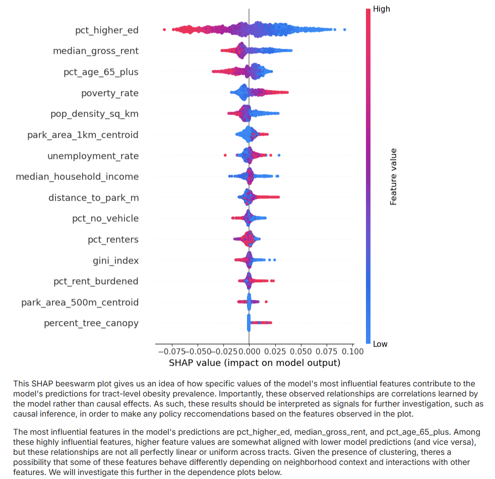

# Neighborhood Opportunity & Resilience Index (NORI) — NYC

**Summary:**  

A neighborhood-level prediction system for informing targeted policy interventions and investment. Built using a combination of community health data, socioeconomic indicators, and environmental features, this tool incorporates predictions from multiple machine learning models. Together, these predictions create an integrated scoring mechanism for measuring neighborhood vulnerability to the compounded effects of health risks and strained economic opportunity. This data-driven approach facilitates more effective strategies for equitable resource allocation and the design of more interconnected, systems-based programs and interventions. 
---

## Problem Statement

City governments, NGO's, and policy advocates often lack a unified, data-driven way to prioritize neighborhoods for health and economic investment. Health burdens and economic mobility constraints frequently overlap, yet are analyzed in isolation. This project addresses that gap by building an explainable spatial machine learning pipeline that predicts neighborhood-level health risk and economic mobility, then combines them into a single composite index: the **Neighborhood Opportunity & Resilience Index (NORI)**. This allows for targeted, evidence-informed policy interventions. 

---

## Model Explainability

### Health Model — SHAP Summary

### Health Model - Median Rent Dependence Plot (Interaction with Education Attainment)

---

## Data Sources

All data used is public and commonly utilized in policy and urban research:

- **CDC PLACES** — tract-level modeled chronic disease indicators (health outcomes)
- **Opportunity Atlas** — intergenerational economic mobility metrics
- **American Community Survey (ACS)** — demographics, housing, income
- **OpenStreetMap (OSM)** — parks and green space features
- **NLCD Tree Canopy** — environmental exposure proxy

---

## Methods

### Feature Engineering

Spatial and socioeconomic features were engineered at the census-tract level, including:

- Distance to nearest park  
- Park area within 500m and 1km buffers  
- Percent tree canopy coverage  
- Demographic and housing indicators from ACS  

Geospatial operations were performed using GeoPandas and raster summarization techniques.

---

### Modeling

Two supervised machine learning models were trained independently using the same feature set:

- **Health Risk Model** — predicts chronic health burden (currently obesity prevalence)  
- **Economic Mobility Model** — predicts opportunity constraints (currently income rank of children from low-income families)

XGBoost models were used to capture nonlinear relationships. Spatial awareness was incorporated during validation to reduce geographic leakage and maximize predictive capability in unseen places (borough-based cross validation).

---

### Explainability

Model interpretability is a core focus of this project given the desire to inform practical policy interventions.

- **SHAP (Shapley Additive Explanations)** was used to:
  - Identify global feature importance
  - Examine nonlinear effects and interactions
  - Support policy-facing interpretation

SHAP outputs include summary plots, beeswarm plots, and dependence plots for both models.

---

## Composite Index: NORI

To support prioritization, model outputs were combined into a single index.

- Predictions were **normalized** to ensure equal contribution regardless of distribution.
- Mobility predictions were **inverted after normalization** so that higher values represent higher vulnerability, in line with health predictions which measure risk/vulnerability. 
- The final NORI score is defined as:

**NORI = (Health_Risk_Norm + Mobility_Risk_Norm) / 2**

Higher NORI values indicate neighborhoods facing compounded disadvantage across health and economic mobility measures.

---

## Key Findings

- Housing context, education attainment, and neighborhood age distributions are strong predictors of both obesity prevalence and long-run economic mobility.
- Model predictions are primarily driven by socioeconomic factors, while features from the built and natural environment seem to provide a more context-dependent and conditional influence.
- Health risk and mobility constraints cluster spatially across NYC.
- High-priority tracts align with historically underinvested neighborhoods.

---

## Outputs

Primary artifacts produced in Sprint 1:

- **NYC census-tract choropleth map of NORI**
- **SHAP explainability plots** for health and mobility models
- Ranked tract-level NORI scores for policy prioritization

---

## Policy Relevance

NORI provides a transparent, scalable framework for identifying neighborhoods where environmental health interventions and economic development programs may have the greatest impact. The system is designed to support exploratory analysis, prioritization, and future causal evaluation.

---

## Limitations & Future Work

- Health outcomes are modeled estimates subject to inference limitations.
- Transit accessibility and walkability features will be added in Sprint 2.
- Planned causal extensions include Difference-in-Differences and DoubleML.
- Future infrastructure upgrades include PostGIS-backed storage and automated ETL pipelines.

---

## Tech Stack

- Python
- QGIS
- GeoPandas, Rasterio
- scikit-learn, XGBoost 
- SHAP
- Jupyter
- Streamlit (planned)

---

## Project Status

**Sprint 1 complete** — modeling, explainability, and composite index delivered.  
**Sprint 2 planned** — causal inference, expanded features, and deployment enhancements.

